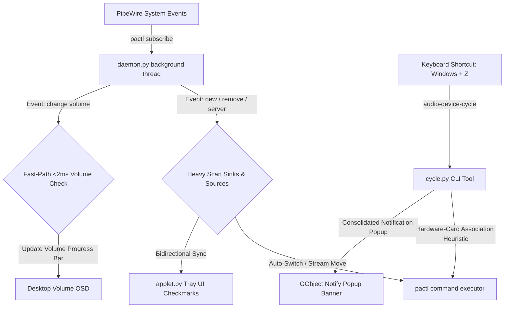

# Audio Device Switcher 🎧🔊

A highly robust, premium system tray applet and background daemon designed for **Pop!_OS (COSMIC & GNOME on Wayland/X11)**. It monitors your connected audio devices in real-time, automatically switches default input/outputs to newly connected hardware (like Bluetooth headsets), redirects all active media streams instantly, and binds a global keyboard shortcut to cycle between matching device pairs.

---

## ✨ Features

*   **⚡ Zero-Lag Volume Adjustments:** Incorporates an ultra-fast, symbolic, hardware-directed caching engine executing volume queries in `< 2ms`, completely preventing D-Bus starvation and built-in system sound panel freezes.
*   **🔄 Bidirectional System Synchronization:** Listens to `pactl subscribe` server-level event changes. Manual default output/input changes made in the built-in system sound controller instantly synchronize our panel tray checkmarks and hover tooltips.
*   **🧠 Hardware-Card Association Heuristics:** Matches rotated outputs with their correct hardware input pairs:
    *   *Bluetooth Headsets:* Traces precise hardware MAC addresses between playback sinks and recording sources.
    *   *Internal/USB Cards:* Pairs laptop **Speakers** with **Internal Microphones**, and **Headphones** with **Headset Microphones** dynamically.
    *   *Loopback Filtering:* Automatically filters out `.monitor` loopback devices to ensure only physical microphone inputs are cycled.
*   **🔔 Wayland & COSMIC Native Popups:** Built natively using python `gi.repository.Notify` GObject bindings. Dispatches fresh notification banner popups upon device cycles that slide in and fade away cleanly.
*   **🎯 One-Click Installation & Hotkey Binding:** A single command installs the applet in user-space, configures XDG Autostart, and **automatically registers a global keyboard shortcut (`Super + Z` / `Windows + Z`)** to cycle audio devices.

---

## 🏗️ Architecture



---

## 🚀 One-Click Installation

To deploy the switcher on this computer, or to set it up on **any other Pop!_OS / Ubuntu / Debian system**, open a terminal in the project folder and run:

```bash
chmod +x install.sh
./install.sh
```

### What happens automatically:
1.  **Dependency Checks:** Installs missing AppIndicator libraries to ensure native tray rendering under Wayland.
2.  **Isolated Sandboxing:** Creates a Python virtual environment (`.venv`) linked with your system site-packages so it runs securely without interfering with your system-wide packages (conforming to PEP 668).
3.  **Shortcut Auto-Binding:** Automatically appends a custom global shortcut (**`Super + Z`** or Windows+Z) to your desktop environment configurations (supports both **COSMIC RON configurations** and **GNOME dconf settings**).
4.  **Autostart Integration:** Places an autostart desktop launcher under `~/.config/autostart/` so the panel applet launches automatically at every login.
5.  **Immediate Startup:** Gracefully stops any old processes and launches the updated indicator applet in your panel instantly!

---

## ⌨️ Global Keyboard Shortcut

Once installed, simply press **`Super + Z`** (Windows key + Z) anywhere on your desktop. Your audio outputs and matching microphones will rotate together instantly, accompanied by a clean on-screen popout notification.

To check or customize this keybind manually:
*   **On COSMIC:** Go to *Settings > Keyboard > Shortcuts > Custom Shortcuts* (you will see the registered `Cycle Audio Devices` shortcut mapped to `/home/username/.local/bin/audio-device-cycle`).
*   **On GNOME:** Go to *Settings > Keyboard > View and Customize Shortcuts > Custom Shortcuts*.

---

## 📁 Repository Structure

```
audio-device-switcher/
├── .gitignore          # Prevents committing local virtual envs and configurations
├── README.md           # This comprehensive guide
├── applet.py           # PyStray GTK-3 Wayland System Tray UI Applet
├── daemon.py           # PipeWire Event Listener & Auto-Switcher Background Daemon
├── cycle.py            # CLI Cycling Tool with card association heuristics
├── icon_generator.py   # Procedural canvas renderer for panel state icons
├── install.sh          # One-Click Automated Installer & Shortcuts Configurator
└── test_indicator.py   # Quick standalone graphics integration test
```

---

## 🤝 Contributing

1.  Clone this repository:
    ```bash
    git clone https://github.com/your-username/audio-device-switcher.git
    ```
2.  The repository is set up with a local sandboxed `.venv`. You can activate it to test changes:
    ```bash
    source .venv/bin/activate
    ```
3.  Run compile checks before submitting updates:
    ```bash
    python3 -m py_compile *.py
    ```
